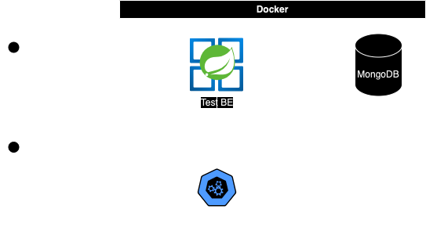
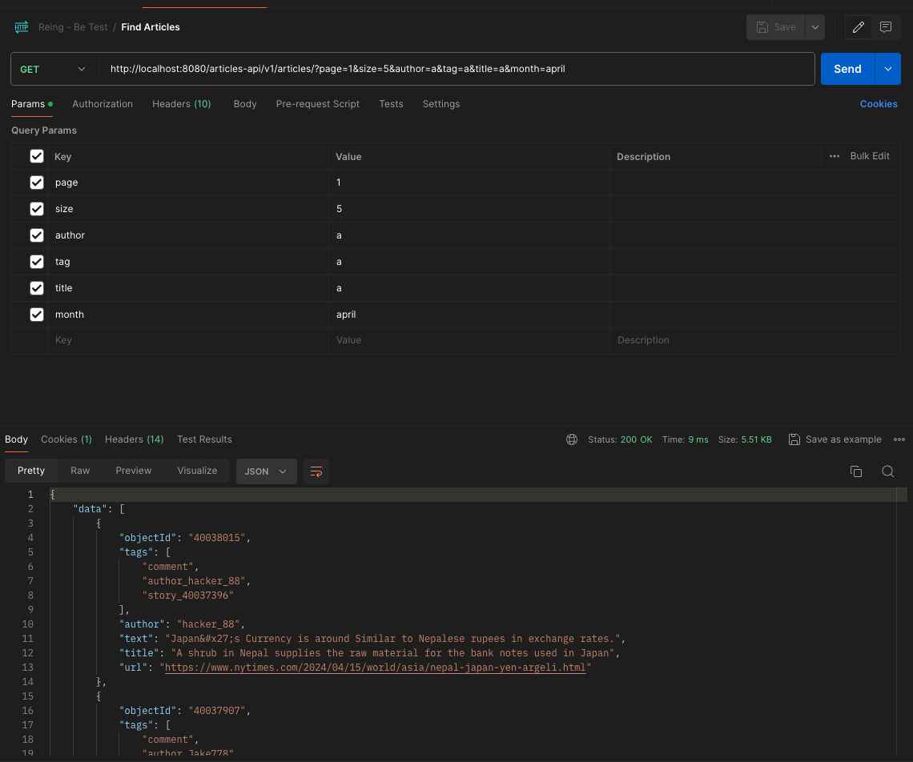
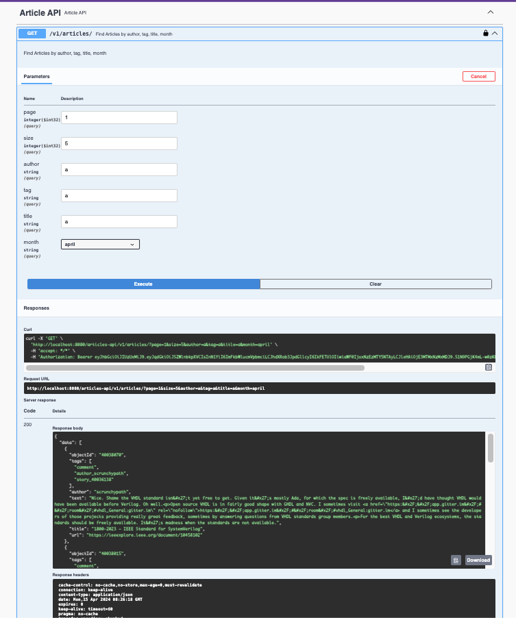
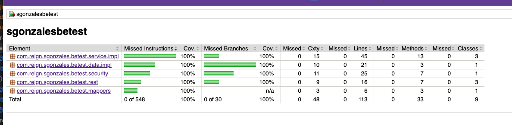

# This is my solution from the challenge from [Reign](https://www.applydigital.com/reign/) 💪

### Table of content

- [Project description](#description)

- [Features](#features)

- [Technologies & Tools](#-technologies--tools)

- [Run on local](#run-on-local)

- [Test evidences](#test-evidences)

- [Authors](#authors)

---------------------------------------------------------------------------------------------------------------------------------------------------------------------------------

## Description

**Context**: We would like you to build a small API to test your knowledge of Java Back End Development and related technologies.

Every hour, the server should automatically make a request to the Algolia API to retrieve the data of recently published articles about [Java on Hacker News](https://hn.algolia.com/api/v1/search_by_date?query=java). It should insert the data from this API into a database and also define a REST API that the client (e.g. Postman) will use to retrieve the data.

The service should return paginated results with a maximum of 5 items, be filterable by author, _tags, title, and also be searchable by month word (e.g. september) using the "created_at" field. It should also allow the user to remove items and not have those
should not reappear when the application is restarted.

An authorization parameter with a JWT must be sent in the headers to access the endpoints.

****

## Features

✅ `Feature 1:` Dummy Login (to generate JWT).

✅ `Feature 2:` Integration API (to populate the database)

✅ `Feature 3:` Find articles by author, tag, title, month paginated

✅ `Feature 4:` Delete an article by objectId

---------------------------------------------------------------------------------------------------------------------------------------------------------------------------------

## 🛠 Technologies & Tools

- **Language:** Java 21 GraalVM
- **Framework :** Spring Boot 3
- **Architecture :** Layered Architecture
- **Web framework :** Spring REST
- **Data framework :** Spring Data Mongo
- **Database :** Mongo
- **Api Docs :** Spring Doc
- **Container :** Docker and Docker compose

---------------------------------------------------------------------------------------------------------------------------------------------------------------------------------

## Run on local

### Requirements
- Docker
- Postman

### steps
1. Clone the repo
2. Inside the root folder of the project run `docker-compose up -d` this will generate the backend image (take patience because is using graalvm native compile) after that will load mongo, mongo express and backend. For the backend the port is 8080
3. To generate JWT token for user (Only can find Articles) use user/password; for the admin user (Populate BD, Delete an article) use adminreing/password
4. To populate the bd use the Populate BD Endpoint is Postman but is required generate the JWT with adminreing user
5. Use the postman collection to test [Postman collection](readme-files/reign.postman_collection.json) inside this collection are the required request and examples to test the solution.
6. To enter to the [Swagger UI](http://localhost:8080/articles-api/docs/swagger-ui/index.html)
7. To enter to the [Mongo Express](http://localhost:8081/)

## Test evidences

-------------------------------------------------------------------------------------------------------------------------------------------------------------------------

## Authors

| [ Samuel Gonzales](https://github.com/samusfree) |  
|:---------------------------------------------------------------------------------------------------------------------------------------:|
